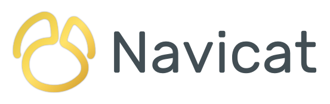

<h2>Le rendez-vous annuel de la communauté francophone de PostgreSQL !</h2>

<!--

<iframe width="560" height="315" src="https://www.youtube.com/embed/wpSuumIHzjY?si=DlKxJBHMXPk5FPOP" title="YouTube video player" frameborder="0" allow="accelerometer; autoplay; clipboard-write; encrypted-media; gyroscope; picture-in-picture; web-share" referrerpolicy="strict-origin-when-cross-origin" allowfullscreen></iframe>

-->

<h2>PG Day France 2025 : Rendez-vous à Mons ! 🇧🇪</h2>

Cette année, le PG Day France franchit les frontières et vous invite à Mons, en Belgique, les 3 et 4 juin 2025 !

<strong>Au programme de ces deux jours :</strong>
* <strong>Mardi matin</strong> : Ateliers pratiques pour approfondir vos compétences PostgreSQL.
* <strong>Mardi après-midi & Mercredi</strong> : Conférences, table ronde et lightning talks pour échanger avec la communauté et les experts.

Passionné·es, étudiant·es, DBA, développeur·euses et entreprises, tou·tes se retrouvent pour partager et apprendre autour de PostgreSQL !
Restez connecté·es pour plus de détails et l'ouverture des inscriptions.

<!--

<h3><a href='/appel'>L'appel à conférencier·ères est ouvert !</a></h3>

-->
<!--

  

    <a href="/programme" type="button" class="btn btn-primary btn-lg btn-block">Programme en ligne !</a>
  

-->

<h2>PG Day France 2025 : See You in Mons! 🇧🇪</h2>

The PG Day France is the annual conference of the French-speaking PostgreSQL community.

This year, the event will take place on **June 3 and 4, 2025, in Mons (Belgium)**. We are seizing the opportunity to expand beyond borders by also accepting presentations in English! To maintain the primarily French-speaking identity of PG Day France, the CfP committee will ensure a balanced distribution of languages.

So, if you are an expert in a field related to open-source databases, have used PostgreSQL in a specific context (_large-scale deployments, high loads, well-known clients, innovative projects, etc._), or are involved in an open-source project related to PostgreSQL, don't hesitate to submit a talk!

<strong>Program for these two days:</strong>
* <strong>Tuesday morning</strong>: Hands-on workshops to deepen your PostgreSQL skills.
* <strong>Tuesday afternoon & Wednesday</strong>: Conferences, panel discussions, and lightning talks to engage with the community and experts.

Enthusiasts, students, DBAs, developers, and companies: everyone comes together to share and learn about PostgreSQL!
Stay tuned for more details and the opening of registrations.

<!--

<h3><a href='/appel'>Call for Paper is open!</a></h3>

-->
<!--

  

    <a href="/programme" type="button" class="btn btn-primary btn-lg btn-block">Schedule available!</a>
  

-->

 

<h2><a href='/partenaires'>Sponsors</a></h2>

  

  
  

  

  
  

  

  
  

  

  
  

 

<iframe width="560" height="315" src="https://www.youtube.com/embed/videoseries?list=PL8hcbCbHVHQlCjZcqCdUrKX1-SD9aTN33" title="YouTube video player" frameborder="0" allow="accelerometer; autoplay; clipboard-write; encrypted-media; gyroscope; picture-in-picture; web-share" referrerpolicy="strict-origin-when-cross-origin" allowfullscreen></iframe>
 Vous pouvez consulter les vidéos des éditions précédentes sur <a href="https://www.youtube.com/channel/UCR7skKC85Zn6p7fJ-lW7G8g">notre chaîne Youtube</a>.

