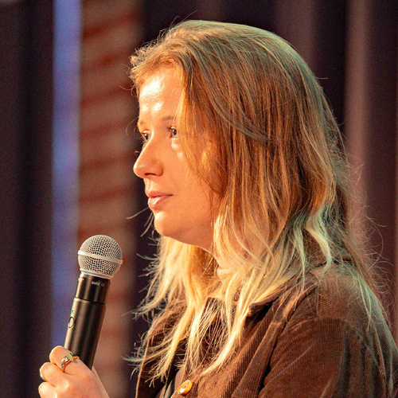

# Programme / Schedule

## Mardi 3 juin 2025 / Tuesday, June 3rd, 2025

  
09h30

  

  
  

  
<h3>Ouverture des portes / Doors open</h3>

  
10h00

  

  <i class="fa fa-laptop"></i>
  

  

  <h3>Atelier : Industrialisez vos déploiements PostgreSQL avec pglift et Ansible</h3>
  
Par Alexandre Pereira et Julian Vanden Broeck - <a href="https://www.dalibo.com/">Dalibo</a>

  

Dans cet atelier, nous verrons comment déployer des instances, bases de données et rôles PostgreSQL à l'aide de pglift et Ansible pour industrialiser vos environnements.
De l'installation à la configuration, en passant par la gestion des utilisateurs, des extensions et la mise en place de la sauvegarde physique avec pgBackRest, vous utiliserez des collections Ansible et des playbooks réutilisables pour déployer vos bases de données PostgreSQL.
  

  

  
10h00

  

  <i class="fa fa-laptop"></i>
  

  

  <h3>Atelier : Déployer PostgreSQL sur Kubernetes avec CloudNativePG</h3>
  
<a href="https://aws.amazon.com/">AWS</a>

  

  
12h00

  

  <i class="fa fa-spinner"></i>
  

  

  <h3>Pause / Lunch break</h3>
  
Le repas du mardi midi n'est pas inclus. Une pause est prévue pour se restaurer à l'extérieur. Merci de votre compréhension.

  
Tuesday lunch is not included. A break is scheduled so participants can eat outside. Thank you for your understanding.

  

  
13h30

  

  
  

  

  <h3>Ré-Ouverture des portes / Doors reopen</h3>
  

  
14h00

  

  
  

  

  <h3>Mot d'accueil / Welcome speech</h3>
  

  
14h15

  

  
  

  

  <h3>Keynote : Où sont passées les femmes de l'histoire de la tech?</h3>
  
Par <a href="orateurs#l_durieux" class="pg_speaker_name">Laura Durieux</a>

  

  Ada Lovelace, Hedy Lamarr, les « ENIAC Girls », Grace Hopper, Joan Clarke... Découlant du métier de calculatrice, le métier de développeur était considéré comme un métier de femme, tandis que la conception hardware était un métier d'homme. Cependant, qui sont ces femmes qui ont fait évoluer le monde de la tech ? Pourquoi n'entendons-nous jamais parler d'elles ? Avec Laura Durieux, vous tenterez de remettre les pendules à l'heure, petit à petit, et de vous offrir des modèles dans la tech dont vous avez toujours eu besoin.
  

  

  
15h00

  

  
  

  

  <h3>Postgres sur Kubernetes pour le DBA réticent</h3>
  
Par <a href="orateurs#k_jex" class="pg_speaker_name">Karen Jex</a> - Crunchy Data

  

  En tant que DBA de la vieille école, vous n'aimez pas forcément l'idée de faire tourner vos bases de données sur Kubernetes. Je comprends - vous avez passé des années à apprendre votre métier, et à construire votre boîte à outils DBA. Vous savez comment gérer un environnement de base de données fiable, sécurisé et performant. Pourquoi risquer tout cela en migrant vers Kubernetes ? De plus, Kubernetes n'est-il pas uniquement pour les applications stateless ? Mais le paysage des bases de données évolue rapidement, et les bases de données sur Kubernetes est devenu normal. Je vous assure que Kubernetes va compléter votre expertise DBA en vous fournissant de nouveaux outils puissants.
  

  

  
15h45

  

  
  

  

  <h3>Pause / Coffee break</h3>
  

  
16h15

  

  
  

  

  <h3>Tout savoir sur max_connections</h3>
  
Par <a href="orateurs#g_lelarge" class="pg_speaker_name">Guillaume Lelarge</a> - Dalibo

  

  max_connections est certainement un des paramètres les plus connus, mais sa configuration n'est pas forcément aisé pour autant. Sa configuration peut avoir de nombreuses conséquences positives comme négatives, que ce soit sur la configuration d'autres paramètres, sur le fonctionnement du système, sur des outils à mettre en place. Il a l'air d'être très connu mais il y a tellement de choses à dire sur ce paramètre. Je vais donc faire un tour complet de ce paramètre.
  

  

  
16h45

  

  
  

  

  <h3>Lightning Talks</h3>
  

    Une série de lightning talks de 5 minutes. Chaque participant au PG Day peut choisir le sujet de son choix (technique ou non) et le présenter en 5 minutes top chrono ! :)
     Envoyez vos propositions à <a href="mailto:contact@pgday.fr">contact@pgday.fr</a>
  

  

    A series of 5-minute lightning talks. Each PG Day participant is welcome to choose any topic (technical or not) and present it in exactly 5 minutes, stopwatch-style! :)
     Send your proposals to <a href="mailto:contact@pgday.fr">contact@pgday.fr</a>
  

  

  
17h30

  

  
  

  

  <h3>Mot de clôture / Closing session</h3>
  

## Grande soirée communautaire / Community Reception

  
19h30 - 23h00

    

  
  

  

  <h3>Grande soirée ouverte à tous·tes et incluse dans le prix de votre billet.</h3>
  
A deux pas du lieu de l'événement, tous les participant·e·s, sponsors et orateurs·rices se retrouvent pour une grande soirée de rencontre et de partage autour d'un apéritif dînatoire.

  
Lieu de Rendez-vous : <strong>Le Brasse-Temps Mons</strong>, Complexe Imagix, Boulevard André Delvaux, 1 - 7000 Mons

   
  <h3>Community reception included in the price of your ticket.</h3>
  
Just a stone's throw from the event venue, all participants, sponsors, and speakers are invited to gather for a vibrant evening of connection and sharing over a standing dinner reception.

  
Location: <strong>Le Brasse-Temps Mons</strong>, Complexe Imagix, Boulevard André Delvaux, 1 - 7000 Mons

  
<strong>COMMUNITY EVENT SPONSOR</strong> 

  

## Mercredi 4 juin 2025 / Wednesday, June 4th, 2025

  
08h30

  

  
  

  

  <h3>Ouverture des portes / Doors open</h3>
  

  
09h00

  

  
  

  

  <h3>Anatomy of Table-Level Locks in PostgreSQL</h3>
  
Par <a href="orateurs#g_yildirim" class="pg_speaker_name">Gülçin Yıldırım Jelinek</a> - Xata

  

  Managing schema changes in PostgreSQL without downtime is challenging. Table-level locks during DDL operations like ALTER TABLE can slow applications or cause service interruptions.
   We’ll cover lock types, how PostgreSQL handles them, MVCC design and lock queuing mechanics. Attendees will learn how to minimize locking impact using battle-tested techniques by going over query examples. We will also talk about an open-source tool pgroll, which applies the expand/contract pattern for lock-free schema changes.
   By the end, attendees will have practical strategies to manage locks, ensuring data integrity and minimal downtime.
  

  

  
09h45

  

  
  

  

  <h3>Réglage automatisé de PostgreSQL : Explorer l'optimisation des paramètres serveur</h3>
  
Par <a href="orateurs#l_nardi" class="pg_speaker_name">Luigi Nardi</a> - DBtune

  

  Nous explorerons le monde complexe du réglage des paramètres du serveur PostgreSQL, où PostgreSQL révèle une multitude de paramètres configurables qui régissent son fonctionnement. L'abondance, la relation non linéaire et la complexité de ces paramètres soulignent l'importance de leur paramétrage optimal afin d'optimiser les performances des applications. Cette présentation introduit diverses approches, du réglage manuel traditionnel à des outils basés sur des heuristiques tels que PGTune et PostgreSQL Configurator, puis l'autoréglage avec machine learning. Nous partagerons des leçons apprises lors du développement d'un autotuner PostgreSQL prêt pour le système de production.
  

  

  
10h30

  

  
  

  

  <h3>Pause / Coffee break</h3>
  

  
11h00

  

  
  

  

  <h3>Table ronde - Comment contribuer à PostgreSQL ?</h3>
  

  Contribuer à PostgreSQL ne se limite pas au code ! Cette table ronde explore les multiples façons de s'impliquer dans l'écosystème : développement, extensions, outils connexes, documentation, traduction, promotion de la diversité, et bien plus.
   Des témoignages d'entreprises et de contributeur·ice·s éclaireront les différents chemins pour soutenir PostgreSQL, y compris à l'échelle d'une organisation.
  

  <h3>Roundtable - How to Contribute to PostgreSQL?</h3>
  

  Contributing to PostgreSQL goes far beyond writing code! This roundtable will explore the many ways to get involved in the ecosystem: development, extensions, related tools, documentation, translation, diversity advocacy, and more.
   Insights from companies and contributors will highlight the various paths to supporting PostgreSQL, including from within an organization.
  

  

  
12h00

  

  
  

  

  <h3>Repas / Lunch</h3>
  

  
14h00

  

  
  

  

  <h3>Lightning Talks</h3>
  

    Une série de lightning talks de 5 minutes. Chaque participant au PG Day peut choisir le sujet de son choix (technique ou non) et le présenter en 5 minutes top chrono ! :)
     Envoyez vos propositions à <a href="mailto:contact@pgday.fr">contact@pgday.fr</a>
  

  

    A series of 5-minute lightning talks. Each PG Day participant is welcome to choose any topic (technical or not) and present it in exactly 5 minutes, stopwatch-style! :)
     Send your proposals to <a href="mailto:contact@pgday.fr">contact@pgday.fr</a>
  

  

  
14h45

  

  
  

  

  <h3>Comment se débarrasser de Full Page Write ?</h3>
  
Par <a href="orateurs#f_coelho" class="pg_speaker_name">Fabien Coelho</a> - Mines Paris - PSL

  

  La présentation s'intéressera aux performances de Postgres sur de grosses machines virtuelles (disons qui peuvent dépasser 50,000 tps avec pgbench), en particulier en analysant l'impact de la configuration _full page write_, pourquoi il faudrait la garder, et comment s'en débarrasser, peut-être, un jour.
  

  

  
15h30

  

  
  

  

  <h3>Pause / Coffee Break</h3>
  

  
16h00

  

  
  

  

  <h3>Voyage au centre des statistiques dans postgres</h3>
  
Par <a href="orateurs#l_leinweber" class="pg_speaker_name">Louise Leinweber</a> - Crunchy Data

  

  Nous allons ensemble parler de statistiques. Vous avez peut être entendu parler de celles ci, elles aident le query planner, elles sont parfois merveilleuses, parfois très approximatives, aujourd’hui nous allons apprendre tout (ou du moins ce qui peut tenir en 45 minutes) sur celles ci.
   Nous parlerons donc:
  - de quelles statistiques Postgres collecte par défaut
  - comment celles-ci sont utilisées par le planner
  - pourquoi elles ne sont pas toujours parfaites, et l’utilité de CREATE STATISTIC
  - les limitations de cette dernière
  - et plus encore si je parle trop vite
  

  

  
16h45

  

  
  

  

  <h3>Comment déplacer une base Postgres avec zéro downtime ?</h3>
  
Par <a href="orateurs#n_mallet" class="pg_speaker_name">Naeva Mallet</a> - Leboncoin

  

  J'ai travaillé sur un projet ou je devais déplacer plus de 150 bases d'instances individuelles vers des instances mutualisées, afin de réduire les coûts. L'objectif était d'automatiser le processus pour déplacer les bases en quelques commandes, et surtout avec le moins de downtime possible. Nous avons utilisé la magie de la réplication logique de postgres et développé un script open source pour déplacer une base en 2 commandes.
  

  

  
17h15

  

  
  

  

  <h3>Mot de clôture / Closing session</h3>
  

  
17h30

  

  <h3>The End</h3>
  

